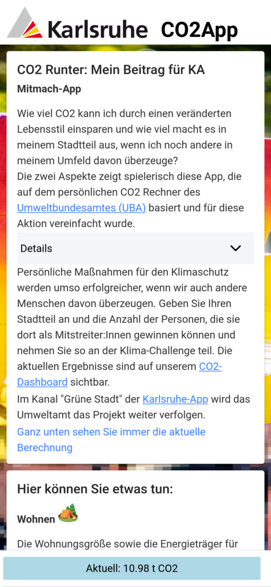

# CO2App for "Bunte Nacht" Event

Version used at [Bunte Nacht, 1.7.2022](https://ok-lab-karlsruhe.de/projekte/bunte-nacht/)

With **SIMPLE** backend, see [rest.php](public/rest.php)

Backend requires config.ini, see [config.ini.template](public/config.ini.template) and mysql initialisation, see 
[co.sql](public/co2.sql)

Cooperates with [co2dash](https://github.com/CodeforKarlsruhe/co2dash) 

## Demo
See [here](https://co2app.ok-lab-karlsruhe.de/)

## Issues
Server for "Bunte Nacht" is Debian 9 (old old old). There are some issues with PHP and Mysql versions.
*Districts*-table seems to be non-UTF8, which breaks json_encode on newer versions but not on this one.
 However, newer flags like *JSON_INVALID_UTF8_SUBSTITUTE* don't work here ...

